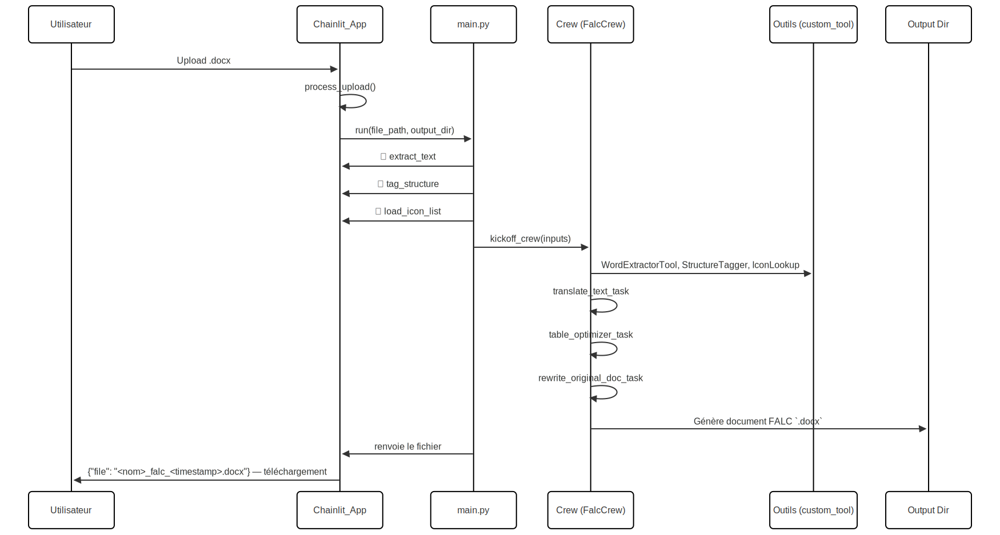

# Assistant FALC README

Bienvenue dans **Assistant FALC**, un service complet de simplification de documents Word (.docx) en langage FALC (Facile À Lire et à Comprendre).
Cette documentation vous guide pas à pas pour installer, configurer et exploiter la plateforme, et explique comment un administrateur IT peut gérer les modèles de référence et les lignes directrices FALC.

## Table des matières

1. [Présentation](#présentation)
2. [Fonctionnalités clés](#fonctionnalités-clés)
3. [Installation & Prérequis](#installation--prérequis)
4. [Personnalisation](#personnalisation)
   - [Agents & Tâches (YAML)](#agents--tâches-yaml)
   - [Ajouter / Supprimer des modèles de référence](#ajouter--supprimer-des-modèles-de-référence)
   - [Mettre à jour les lignes directrices FALC](#mettre-à-jour-les-lignes-directrices-falc)
6. [Utilisation](#utilisation)
   - [Interface Chainlit (Chat)](#interface-chainlit-chat)
   - [Commandes CLI](#commandes-cli)
7. [Description des fichiers](#description-des-fichiers)
8. [Flux de traitement (sequence flow)](#flux-de-traitement-sequence-flow)

## 1. Présentation

**Assistant FALC** combine :

- **Chainlit** : Interface chat et gestion de session
- **CrewAI + OpenAI** : Orchestration d’agents spécialisés pour :
  - Traduction
  - Optimisation de tableaux
  - Design
- **python-docx** : Extraction et génération de documents Word
- **Outils personnalisés (`custom_tool.py`)** :
  - Extraction de texte
  - Balisage de structure
  - Insertion d’icônes et de tables
  - RAG pour modèles de référence

L’objectif est de simplifier automatiquement vos lettres et formulaires administratifs en produisant un document Word conforme aux règles FALC.

## 2. Fonctionnalités clés

- 💬 **Interface conversationnelle** : Déposez un `.docx`, récupérez le FALC traduit.
- 🤖 **Multi-agent CrewAI** :
  - Extraction du texte
  - Détection de la zone à remplacer
  - Traduction FALC
  - Optimisation en tables
  - Génération du `.docx` final
- 📂 **Gestion des modèles de référence (RAG)**
- 🛠️ **Personnalisation** : Ajout/suppression de modèles, mise à jour des directives
- 🔧 **CLI pour entraînement du FALC Crew**

## 3. Installation & Prérequis

### 1. Cloner le dépôt

```bash
git clone https://github.com/JulsdL/falc_crew
cd falc_crew
```
### 2. Python 3.12+ & pip
Créer et activer un environnement virtuel :

```bash
python -m venv venv
source venv/bin/activate    # macOS/Linux
# ou
venv\Scripts\activate       # Windows
```

### 3. Installer les dépendances
FalcCrew utilise UV pour la gestion des dépendances. Si UV n’est pas installé :
```bash
pip install uv
```
Ensuite, installez les dépendances :

```bash
uv install
```
### 4. Configurez les variables d’environnement
```bash
cp .env_example .env
```
Éditez le fichier .env et ajoutez vos secrets:
```bash
OPENAI_API_KEY="sk-..."
LANGFUSE_PUBLIC_KEY="pk_..."
LANGFUSE_SECRET_KEY="sk-..."
LANGFUSE_HOST="https://api.langfuse.com"
```

Vous pouvez créer votre compte Langfuse gratuitement ici : [Langfuse](https://cloud.langfuse.com/auth/sign-in).

## 4. Personnalisation

### Agents & Tâches (YAML)

Les **agents** et **tâches** sont configurés via deux fichiers YAML :

| Fichier                  | Rôle                                      |
|--------------------------|-------------------------------------------|
| `config/agents.yaml`     | Déclare les **agents AI**                 |
| `config/tasks.yaml`      | Décrit les **tâches** (« jobs ») à exécuter |

Modifiez-les pour ajuster prompts, rôles et workflow.

### Ajouter / Supprimer des modèles de référence
Les modèles de référence FALC (pour le RAG) sont stockés dans :
```bash
data/reference_models/
```
  - Ajouter : Déposez simplement votre fichier .docx dans ce dossier. Vérifier d'abord que le fichier ne contien pas de données sensible et qu'il s'ouvre correctement.

   -Supprimer : Retirez le fichier correspondant pour qu’il ne soit plus utilisé.

Note : Les changements sont pris en compte au redémarrage de l'application.

### Mettre à jour les lignes directrices FALC
Le guide éditorial FALC est situé dans :
```bash
knowlegde/falc_guidelines.md
```
  - Modifier : Ouvrez et éditez ce fichier pour ajuster vos règles (longueur de phrase, formatage, lexique, etc.).

  - Sauvegarder : La prochaine invocation de la Crew utilisera automatiquement la version mise à jour.

## 5. Utilisation
Démarrer avec l'interface Chainlit (Front-end Chat)
```bash
chainlit run src/chainlit_app.py
```
1. Ouvrez http://localhost:8000.
2. Déposez votre document .docx.
3. Patientez (~1 min).
4. Téléchargez le .docx FALC généré.


## 6.Description des fichiers

### chainlit_app.py

| Élément          | Description                                                                 |
|------------------|-----------------------------------------------------------------------------|
| **But**          | Interface chat pour uploader un `.docx`, lancer la traduction & renvoyer le fichier FALC. |
| **Librairie**    | `chainlit`                                                                  |
| **Fonctions clés** | `on_chat_start`, `process_upload`, `on_message`, `end`                     |

**Flux principal** :

1. **Démarrage** (`@cl.on_chat_start`) :
   - Génère un `session_id` (UUID).
   - Crée `temp_uploads/<session_id>` et `output/<session_id>`.
   - Accueil utilisateur et démarrage de l’upload.
2. **Upload** (`process_upload`) :
   - Invite l’utilisateur à copier-colle un `.docx`.
   - Sauvegarde locale et message « Traitement en cours ».
   - Appelle `run(file_path, output_dir)` (depuis `main.py`).
   - Envoie le `.docx` FALC généré.
   - Boucle pour un nouvel upload.
3. **Fin de session** (`@cl.on_chat_end`) :
   - Supprime les répertoires temporaires.

### falc_crew/crew.py

| Élément            | Description                                                                 |
|--------------------|-----------------------------------------------------------------------------|
| **But**            | Définition de la **Crew** : agents, tâches, processus.                      |
| **Librairies**     | `crewai`, `crewai.project`                                                  |
| **Classe**         | `FalcCrew(CrewBase)`                                                         |

**Agents définis** :

| Agent                         | Outils intégrés                                                        | Mémoire | Rôle rapide                               |
|-------------------------------|------------------------------------------------------------------------|---------|--------------------------------------------|
| `falc_translator`             | `FalcIconLookupTool`, `WordExtractorTool`, `ReferenceModelRetrieverTool` | ✔️      | Simplifier le texte en FALC                |
| `table_optimizer`             | Aucun                                                                   | ✔️      | Repérer et transformer des blocs en tables |
| `falc_document_designer`      | `FalcDocxWriterTool`                                                    | ✔️      | Générer le `.docx` final structuré         |

**Tâches** :

| Tâche                         | Description                                                         |
|-------------------------------|---------------------------------------------------------------------|
| `translate_text_task`         | Traduction en FALC                                                   |
| `table_optimizer_task`        | Détection & remplacement par placeholders de tables                  |
| `rewrite_original_doc_task`   | Réécriture du `.docx` original avec le contenu FALC                 |

**Crew** :

- **Processus** : Séquentiel (`Process.sequential`)
- **Sources de connaissances** :
  - `falc_guidelines.md` (règles éditoriales)
  - `icons.json` (inventaire d’icônes)


### main.py

| Élément         | Description                                                      |
|-----------------|------------------------------------------------------------------|
| **But**         | Point d’entrée CLI & wrapper Chainlit pour lancer la **Crew**.  |
| **Fonctions clés** | `extract_text`, `tag_structure`, `load_icon_list`, `run`, `train`, `replay`, `test` |
| **Telemetry**   | Intégration **Langfuse** & **OpenLit**                           |

#### Steps Chainlit

Chaque étape annotée `@cl.step` :

1. **📄 Lecture du document Word** : extraction du texte brut.
2. **🔍 Analyse de la structure** : repérage des bornes à remplacer.
3. **🔎 Chargement des icônes** : inventaire des icônes.
4. **📄 Lancement Crew** : exécution asynchrone des agents.


#### Commandes CLI

```bash
# Lancer l’UI Chainlit
chainlit run chainlit_app.py

# Entraînement de FALC Crew
crewai train
```

### falc_crew/tools/custom_tool.py

| Outil                             | Rôle                                                                                 |
|-----------------------------------|--------------------------------------------------------------------------------------|
| **WordExtractorTool**             | Extrait le texte brut d’un `.docx`.                                                  |
| **FalcDocxStructureTaggerTool**   | Identifie les indices de paragraphes à remplacer.                                    |
| **FalcIconLookupTool**            | Fournit la liste des icônes disponibles depuis `icons.json`.                         |
| **FalcDocxWriterTool**            | Génère un `.docx` structuré : insertion d’icônes `[[ICON:…]]` et de tables `[[TABLE:…]]`. |
| **ReferenceModelRetrieverTool**   | Outil RAG pour retrouver des modèles FALC de référence.                              |

Chaque outil hérite de `BaseTool` ou `RagTool`, définit un schéma d’entrée (`args_schema`) et une méthode `_run()`.

### config/agents.yaml

| Agent                       | Rôle               | Objectif                                                    |
|-----------------------------|--------------------|-------------------------------------------------------------|
| `falc_translator`           | FALC Translator    | Simplifier un texte complexe en FALC.                       |
| `table_optimizer`           | Table Optimizer    | Repérer les blocs logistiques et proposer des `[[TABLE:…]]`. |
| `falc_document_designer`    | Doc Designer       | Produire le `.docx` final selon les normes typographiques.  |

```yaml
falc_translator:
  role: >-
    FALC Translator
  goal: >-
    Convert complex text into ...
  backstory: >-
    You're an expert in simplifying French ...
...
```

### config/tasks.yaml

| Tâche                        | Description                                                                                                                                       | Agent               |
|------------------------------|---------------------------------------------------------------------------------------------------------------------------------------------------|---------------------|
| `translate_text_task`        | Traduire le texte, insérer icônes `[[ICON:…]]`, structurer en paragraphes pour le Table Optimizer.                                                | falc_translator     |
| `table_optimizer_task`       | Regrouper les paragraphes logistiques en tables, remplacer dans `body_sections`, produire `tables` avec métadonnées.                              | table_optimizer     |
| `rewrite_original_doc_task`  | Supprimer la zone d’origine (indices `replace_start` à `replace_end`), insérer header/subject/body/tables via `FalcDocxWriterTool`.              | falc_document_designer |

---

## 7. Flux de traitement

